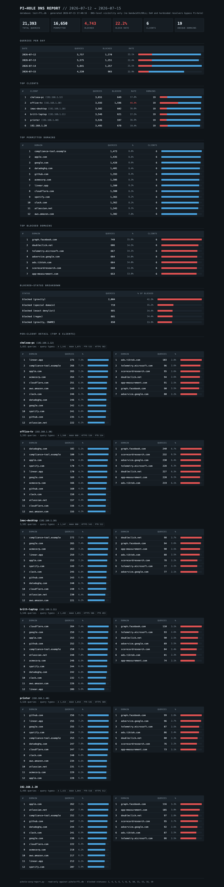

# pihole-digest

[](https://github.com/vechiato/pihole-digest/actions/workflows/tests.yml)
[](LICENSE)
[](README.md#requirements)

SARG-style HTML report generator for Pi-hole. Reads the FTL long-term database (`/etc/pihole/pihole-FTL.db`) directly and produces a single self-contained HTML report, no external dependencies.

If you've used SARG with Squid/SquidGuard, this is the closest DNS-level equivalent: per-client activity, top permitted and blocked domains, and blocked-status breakdowns over an arbitrary date range.

## What it produces

A single HTML file containing:

- **Summary**: total queries, permitted/blocked counts, block rate, unique clients and domains
- **Queries per day**: daily volume with stacked permitted/blocked bars
- **Top clients**: query volume, blocked count, per-client block rate, unique domains
- **Top permitted domains** and **top blocked domains** across the whole network
- **Blocked-status breakdown**: gravity vs regex vs exact denylist vs upstream blocks
- **Per-client detail**: top permitted and blocked domains plus query-type breakdown (A, AAAA, HTTPS, PTR, etc.) for the busiest clients

Client IPs are resolved to hostnames using FTL's own `network_addresses` table. The `--resolve` flag adds a reverse-DNS fallback for anything FTL has no name for.



## Requirements

- Python 3.8+ (stdlib only, uses `sqlite3`)
- Read access to `pihole-FTL.db` (run as root or a user in a group that can read it)

The database is opened read-only (`mode=ro`), so it is safe to run against a live FTL instance.

## Install

```bash
curl -o /usr/local/bin/pihole-digest \
    https://raw.githubusercontent.com/vechiato/pihole-digest/main/pihole-digest.py
chmod +x /usr/local/bin/pihole-digest
```

## Usage

```bash
# Last 7 days (default), writes pihole-digest.html to the current directory
pihole-digest

# Last 30 days
pihole-digest --days 30

# Explicit date range (inclusive)
pihole-digest --from 2026-07-01 --to 2026-07-14

# Custom database path and output location
pihole-digest --db /etc/pihole/pihole-FTL.db \
    --output /var/www/html/pihole-digest.html
```

(Running from a clone without installing: `./pihole-digest.py` in place of `pihole-digest`.)

### Options

| Flag | Default | Description |
|------|---------|-------------|
| `--db` | `/etc/pihole/pihole-FTL.db` | Path to the FTL database |
| `--days` | `7` | Report on the last N days |
| `--from` / `--to` | | Explicit date range (`YYYY-MM-DD`), overrides `--days` |
| `--top` | `25` | Rows in each top-N table |
| `--max-clients` | `20` | Number of per-client detail sections |
| `--per-client-top` | `15` | Domains per client detail table |
| `--output` | `pihole-digest.html` | Output file |
| `--resolve` | off | Reverse-DNS fallback for unnamed clients |

## Scheduled reports

Daily cron dropping dated reports into a web root, SARG-style:

```cron
15 6 * * * root /usr/local/bin/pihole-digest --days 7 \
    --output /var/www/html/reports/digest-$(date +\%F).html
```

Weekly rollup on Mondays:

```cron
0 7 * * 1 root /usr/local/bin/pihole-digest --days 7 \
    --output /var/www/html/reports/weekly-$(date +\%F).html
```

If serving reports via Pi-hole's own lighttpd, drop them under `/var/www/html/` and they'll be reachable alongside the admin UI. Consider access controls: the reports expose per-client browsing patterns.

## Notes and limitations

- **DNS-level visibility only.** Pi-hole sees DNS queries, not traffic. There is no bandwidth, URL path, or authenticated-user data as with SARG/Squid. Reports are keyed on client IP/hostname and domain.
- **Bypass caveat.** Clients using DoH/DoT or a hardcoded upstream resolver will not appear in these reports at all.
- **Retention.** FTL keeps 365 days of query history by default (`MAXDBDAYS` in `pihole.toml`). Ranges beyond retention return empty days.
- **Status codes.** Blocked statuses are based on Pi-hole v6 FTL codes and listed in the report footer. If you're on an older v5 schema, adjust `BLOCKED_STATUSES` and `STATUS_NAMES` at the top of the script.
- **Performance.** All aggregation happens in SQL, so multi-month databases with millions of rows are fine. A long range on a Raspberry Pi may still take a minute or two.

## Testing

```bash
python3 -m venv .venv
.venv/bin/pip install -r requirements.txt   # coverage, for `coverage run`; tests themselves need nothing
.venv/bin/python -m unittest discover -s tests
```

Uses an in-memory SQLite DB shaped like the FTL schema, stdlib `unittest` only. `requirements.txt`
covers dev/test tooling only — the report generator itself stays stdlib-only, no install needed
to run `pihole-digest.py`.

## Files

- `pihole-digest.py`: the generator
- `docs/sample-report.html`: example output from synthetic data
- `tests/`: unit tests
- `CHANGELOG.md`: version history
